# 世界の世界性の視点依存性テーゼ／世界の多重入れ子構造について

---

# はじめに——議論の弁証法的構造

---

# 世界の世界性の視点依存性テーゼ

初めに結論を提示しておく。

- ある世界が世界性をもつかどうかは、その世界が内側から生きられるか、外側から眺められるか、という観測者の視点に依存する
	- 想像された世界には世界性が**ない**：外側からの眺め
	- 想像された世界にも世界性が**ある**：内側からの信憑

---

# 想像された世界には世界性がない

これはサルトルの準観察テーゼのこと。サルトルにおいて知覚と想像の差異は、最終的には、知覚された世界には世界性があるが、想像されたものには世界性がない、という一点に集約された。

- 細部がない
- 既在性がない
- 射映性と地平性（＝奥行き）がない
- 同一性がない

---

# 想像された世界にも世界性がある

こちらの立場はまだ誰も主張していないので、自前で主張を立てなければならない。サルトルの準観察テーゼに対する反論という形をとって、想像も真性の世界性を備えていることを主張する。

- 反論1：世界性を持つような想像もあるのではないか
	- ex. 子供の空想。一連の長いストーリーをもった「続きもの」の想像。
		- 子供はしばしば、昨日行った空想の続きを今日も考えることで、**同じ世界に**何度も何度も入り直して、その世界の細部をどんどん豊かにしていく
		- これは、我々が昨日も今日もこの同じ知覚世界の中に入ってその細部を観察によって満たしていくのと同じこと。想像も知覚と同じような真正の世界性をもつ
- 反論2：世界性を持たないような知覚もあるのではないか
	- ex. 知覚に対する現象学的還元、とくに形相的還元
		- これは**世界性をもたない知覚**というものを作り出そうとする試みではないか

さしあたり、前者の反論1をさらに展開させる。

---

# 世界の細部を後から埋めることは発見なのか事後的創作なのか

一つの思考実験を例にとって、想像の世界性を否定する立場と肯定する立場との対立を浮き彫りにする。

## 思考実験：空想されたお城の3階には何があったか

空想の「世界」の中で立派なお城に住んでいると言い張る子供に対して、「じゃあ、そのお城の三階部分には何があるの？」とその父親が聞く。子供はとても長い間沈黙した後に、「……ああ、そうだ、使用人が泊まる宿舎があるんだった」と答えた。しかし実際にはその子供は、大人にそう聞かれるまでは、お城に複数の階があるなどという発想すら持っていなかった。だから大人は「いやいや、いま考えたでしょ」といって茶々を入れた。しかし子供は、「いいや違う、いま僕が考えたわけじゃない、元からそうなっていたんだ」と答えた。

---

# 大人vs子供の対立——既在性をめぐる争い

- 大人：「いやいや、いま考えたでしょ」
	- 元から既にそうなっていたお城の上階をいま観察して発見したわけではなく、いま新たに創り上げただけでしょ
		- 想像には**既在性**という世界性の本質が欠如している、という反論
- 子供：「いま僕が考えたわけじゃない、元からそうなってたんだ」
	- 今まで気づかなかっただけで、いま観察して見つけたんだ。僕が勝手に考えたわけじゃない
		- 想像においては人は自分が自分で置き入れたものしか見ない、という準観察テーゼに対する反抗。想像された世界は私が見る前から既にそこにあったのであり、私はそれをただ発見しただけだ、という主張

同じ論点をめぐって真逆の主張がなされている。お互いに相手の主張の意味を完全に理解でき、かつ結論だけが真逆であるため、調停は不可能。

<!-- この対立は非対称的である。子供の側は大人が自分の何を否定しているのか全て分かった上で反論しているが、大人の側は子供がいったい自分の知らない何を見ているのかを見通せる立場にいない。 -->

---

# 子供の逆襲：視点そのものが複数存在することの示唆

先ほどよりちょっと賢い子供を想定する。大人の側の主張の妥当性を全て認めたうえで、その主張の根拠をなしている立脚点そのもののずれを指摘する。

「お父さんの言っていることは分かるよ。それでも僕は毎日、自分の想像の世界の中に入って、そのお城の中で生きてるんだ。お父さんがそうやって言うのは、僕のこの世界の内に一緒に入らないで、それを外から眺める醒めた態度を取ってるからでしょ？」

<!-- 「それに、お父さんだって、いつも楽しみにしている連載小説の続きを読むときは、今まで明らかになっていなかった世界の細部がいま初めて明らかにされた、という態度で読むでしょ？ 僕が「へー、作者は今週はこういう設定でこう創ってみせたんだね」って茶々を入れたら怒るじゃん」 -->

---

# 対立の真の意味——世界の世界性の視点依存性テーゼ

- 空想のお城のあるその世界はほんとうに世界性を備えているか否か、という世界性の有無をめぐる対立があるのではなく、ただ、その世界を内側から見るか外側から眺めるか、という視点の対立だけがあるのだ
- いかなる世界も、内側から生きられたときには真正の世界性をもつ世界として現れ、外側から眺められたときにはただの作り物に見える
	- まだ気づかれていなかったが既に確定していた細部を観察によって後から埋めたのか、ただ単に何も考えていなかったものをいま恣意的に創り出したり修正したりしただけなのか、という根底的な見方の違いが、世界の内に入るか外に出るかという視点の違いだけから生じる

---

# 唯一の客観的世界の絶対性——世界性の視点依存性テーゼへの反論

これで先ほどの対立は調停されたが、しかし、話はこれで終わりにはならない。今度は、想像世界にもフィクションの世界にもインフレ的に認められた世界性に対して、以下のような反論がありうる。

## フッサール的な反論：唯一の客観的世界の絶対性

「確かに子供の言うことには一理ある。どんな世界も、虚構世界であろうと、それが内側から生られたときには真正の世界性をもつ**かのように感じられる**ことはあるだろう。しかし、だからといって、その想像世界やフィクションの世界が**客観的な世界性**をもつ、ということにはならない。世界、と言えるのは**この**世界、知覚された世界であり、これは、どの主観がどの時点から見ても同一性を保ちつづける、客観的にして唯一の世界である。だから、仮に想像ないしフィクションの諸世界を“世界”と呼んでやるとしても、それは真性の意味での世界性、この知覚世界の世界性には及ばない」

---

# 知覚／想像の識別問題の再発——視点依存性テーゼの欠陥

- 「本当の意味で世界と呼べるのはこの知覚世界だけだ」：
	- もし想像も知覚と同じく一つの世界を開く作用であるなら、同じ世界を開くもの同士、どのようにして想像は知覚から識別されているのか分からなくなってしまうではないか。
		- これは視点依存性テーゼが考慮していなかった論点。手痛い反論であり、このテーゼの枠内では応答不可能な問い
	- この識別の問題を、客観的世界の絶対性テーゼは、いったんは想像にもフィクションにもインフレ的に認められた世界性を（この知覚世界の世界性から差別化するために）貶めることによって解決する。「それらは百歩譲って世界であるとしても、我々のこの世界のような真正の世界ではない、たかだか準－世界にすぎない」といったように。

---

# 新たな高次の対立：視点依存性vs客観的世界の絶対性

この対立は先ほどの大人と子供の対立より高次の段階の対立。大人と子供の対立の調停によって得られた高次のテーゼに対して、さらに高次のテーゼが対立している。視点依存性テーゼが考慮していなかった問い（想像世界とこの知覚世界との差異を説明せよ）が突きつけられる。

---

# 世界の多重入れ子構造

次のような世界の入れ子構造を考えてみてほしい。

- 世界1：最も外側にある我々の知覚世界。いつ誰がみても同一の、唯一にして客観的な世界
	- 世界2：この世界1の内側に入れ子になって成立している、想像やフィクションの世界
		- 世界3：例えば、フィクションである演劇のさらに内側で演じられた劇、劇中劇の世界

```mermaid
graph TD
  subgraph 世界1: 我々の唯一の客観的世界
    subgraph 世界2: 虚構の世界
      subgraph 世界3: 虚構の中のそのまた虚構世界
        C[劇中劇]
      end
    end
    subgraph 世界2: 想像の世界
        B[子供のお城]
    end
    A[我々]
  end

style W1 fill: #888
style W2 fill: #666
style W2_2 fill: #666
style W3 fill: #444
```

---

# 観入と上昇による世界移動——世界性の視点依存性テーゼ改

この多重入れ子構造を念頭に置いて、視点依存性テーゼと客観的世界の絶対性テーゼの両方を説明する。まずは視点依存性テーゼのほうから。

- **初期位置**：さて、我々のいる初期位置は世界1、つまりこの知覚世界だ。ここに居ながらにして世界2、例えば誰かの空想についての話を聞かされると、我々はそれを観察された世界ではなく恣意的な作り物にすぎない、と感じる。これは、世界2をその外側である世界1にいる我々が捉えるからだ
- **観入**：しかし、ひとたび彼の空想の世界の話に我々が深く聞き入り、観入し、その世界の内で生きるようになったときには、我々は世界1から世界2に移動して、世界2をその内側から眺める。このとき、内側から生きられた世界2は、同じく内側から生きられているこの世界1と同じような世界性をもつように体験される
- **上昇**：しかし、空想世界2への没入が中断され、ふたたび元いた我々の知覚世界1へと**上昇**したときには、ふたたび、「あれはただの空想にすぎなかった」というように醒めた仕方で体験されなおす

---

# なぜ我々の知覚世界は唯一にして絶対的な客観的世界なのか

これも多重入れ子構造から説明できる。というか、多重入れ子構造はまさにこちらの主張を擁護しつつ止揚するために導入された。

- 答え：我々のこの知覚世界は、入れ子になった諸世界のうち最も外側の世界だから。この世界1よりも外側にあるような、より上位の世界というものがもはや存在しないから
	- 空想の世界（世界2）の外に出てそれを外側から眺めるようにして、我々のこの知覚世界（世界1）の外ることはできない
	- ゆえに我々はこの知覚世界をただもっぱらその内側から生きることしかできない。我々は内側から生きられたときのこの世界をしか知らないので、その世界性は他と違った絶対的な（外側から眺められ無化されることのない）世界性をもつように見える

---

# 知覚と想像の差異の識別問題への答え

想像は知覚と何によって識別されているか、という問いについても、この視点依存性テーゼの単なる系として導出できる。

- 答え：ある**世界越し**に観られた世界、それが想像された世界である。そうではなく直接見られた世界が知覚された世界である
	- 観入とは、正確に捉えるなら、世界1にいる我々が世界2の内へと完全に移動してしまうような経験ではない。世界1に軸足を残したまま世界2の中に入ること、あるいはむしろ、世界1を**額縁**として、そこに嵌め込まれた世界2の中に入ること、これが観入である
	- だから私は観入しているとき、私はいま「入って」いるにすぎない、ということを識っている。すなわち、この目の前に展開されている真正の世界は、どんなに真に迫るものに感じられようとも、しかしその外部がある、ということ、それゆえこれは入れ子にされた世界にすぎないことを、**その当の入れ子の内側から**識っている
		- 「その当の入れ子の内側から」：ゆえに、上昇するまでフィクションだと気づかなかった、ということは起こらない

---

# 積み残した課題と次の議論への移行

- これまで、世界の内側に入ってその内で生きたときには世界はどんなふうに見えるのか、という点については十分記述してきた。世界は無限の細部と奥行きをもち、私が観察する前から既にそうなっていたものが観察によって発見される
- しかし、世界をその外側から眺めたときには何が見えるのだろうか。外側から眺められたときの世界、それは世界性を失って見えるということになるが、それはいったいどんな眺めなのか
- 還元とは。

---

# 外側からの世界の眺めとはどんなものか——サルトルの準観察テーゼの再評価

- 視点依存性テーゼのおかげで、サルトルの準観察テーゼ（想像には世界性がない）はむしろ完全に復活させることができる。すなわち準観察テーゼは、**ある世界をその外側から、世界越しに眺めたときの眺め**の記述としては完全に正しいことになるだろう
	- つまり、サルトルの言う「想像」は、実質的には、「外側から眺められたときの世界」ということしか意味していない。ゆえに「想像」という語を置き換えて読むことができる
		- 彼の言う「想像」が（内側から生きられたり外側から眺められたりした）想像一般を意味していると捉えてしまえば彼のテーゼは偽になる
	- こう捉えれば彼の準観察テーゼを救えるどころか、これが想像だけに限定されたテーゼではない、**任意の世界を**その外側から見たときの眺めに妥当するテーゼとして生まれ変わる
		- ということは、この知覚世界（世界1）をその外側から眺めることができたなら、その外側からの眺めについても、サルトルの準観察テーゼは妥当するのではないか！？
			- →【現象学的還元、とくに形相的還元と準観察テーゼの関係】

---

# 準観察テーゼ再論——外側から眺められた世界が失うもの一覧

世界が外側から眺められたとき世界性を失うなら、世界性の本質を成している次の三つの性質もまた失われることになるだろう。（そしてまた、**知覚世界もまた**外側から見られることができたときにはこれらの性質を失うだろう）

- 既在性を失う：これは理解しやすいし、大人と子供の対立のところですでに見た。すなわち「いま新たに主観が自由に創り出したにすぎない」といったふうな見られ方をする
- 無限の細部を失う：これは**概念的なものとの近さ**を生み出すのではないか
	- →【形相的還元と想像イメージの関係】
- **奥行きを失う**：これはほとんど理解しがたいだろう。奥行き（射映性、地平性）をもたない表象とは何なのか
	- 必ずしも全ての表象が世界構成的であるわけではない。→【世界構成的でない表象】

---

# 世界性がないとは形相的であることだ——外側から眺められた世界が得るもの一覧

準観察テーゼの発展形。「想像には世界性がない」というもっぱら否定的だったテーゼの肯定的側面。想像は概念的本質を直接観て取らせる（＝本質直観させる）ような作用である。

- 余計な細部をもたないことによって、概念的本質を直に見てとることができる
	- 知覚をもとに本質直観をしようとすると、「自由変更」という事実的細部を捨象していく操作を経なければならない
		- しかし想像はそのような捨象されるべき細部をあらかじめ持たない。この貧しさが概念を表示するときには逆に有利に働く
	- 想像とはいわばあらかじめ形相的還元が済んでいるような表象のことである
- 奥行きなく平坦に捉えられることは形相的本質の現れの性質である
	- →【辞書の挿絵の例】

---

# 世界構成的でない表象
