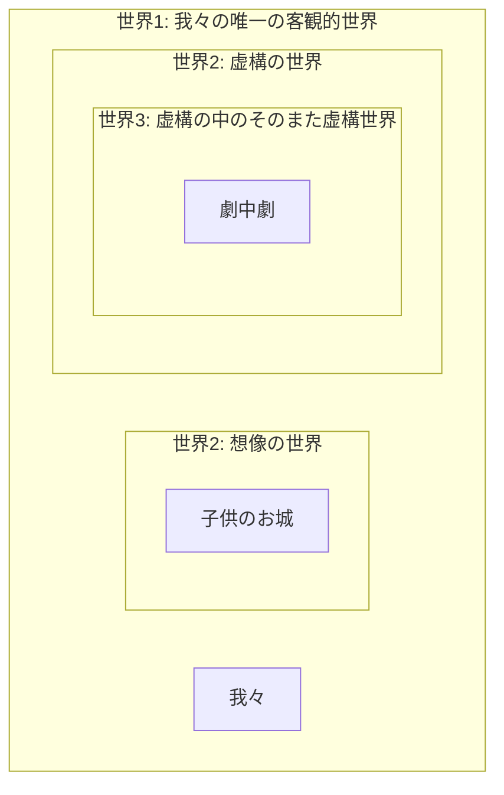

# 世界の世界性の視点依存性テーゼ<br />——サルトル準観察テーゼの止揚——

## 京念屋 隆史

---

# 想像と知覚の識別問題

博論全体を貫く根本的な一つの問い。

- 想像と知覚の差異とは何か、想像はいかにして知覚と識別されているのか
- 見ることと思い浮かべることの差異とは何か。とりわけ、なぜ想像は「心の中で」思い浮かべられているにすぎず、心の外に実在するものの表象ではないと分かるのか

---

# 博論全体の構成

```mermaid
flowchart BT
    A1 --> B1
    A2 --> B1
    B1 --> C[C<br>識別問題への解答]
    B2 --> C
subgraph A 想像の像＝イメージ説批判 
    A1[A1 心像]
    A2[A2 意識像]
end
subgraph B 想像の世界性をめぐる争い
    B1[B1<br/>準観察テーゼ]
    B2[B2<br/>反論]
end
```

---

# A1 **心像を**物的像からの類比によって捉える見方への批判

サルトルのアナロゴン説批判。今ここにない対象の代理物として機能するのが心像である、という見方は維持しえない。

- 我々は想像するとき、心像を対象として見るのではなく、心像を介して対象を思念する、とサルトルは言う
	- 「想像するとは心像を対象として見ることだ」：「内在性の錯覚」つまりイメージの「物」化であるとして批判される見方
	- だが、それを言うなら物的像だって、それに観入するときにはその像そのものを対象として見ることをしないではないか。つまりこれは物的像にも当てはまる議論にすぎない
		- サルトルの見方はまた、イメージの「物」化でないにせよ「物的像」化にすぎない
- 想像が対象を思念するための媒介的な代理物であるなら、心像を通り抜けて対象を思念するのをやめて、心像そのものに留まることが可能であることになってしまうはず。ちょうど物的像において「上昇」が可能であるように
	- アナロゴン説は、なぜ我々はつねに心像を突き抜けて対象そのものを思念してしまうのか、という点を説明できない
		- 「つねに心像を突き抜けて対象そのものを思念してしまう」：これを「透明性」と呼ぶ

---

# A2 **意識像一般を**物的像からの類比によって捉える見方への批判

批判対象はさらに広がり、意識像一般に対する物的像からの類比を徹底的に暴く。（知覚想像の識別問題はいったん脇に退く）

- A1で見たアナロゴン説は、想像と知覚を識別するために、その二つを**構造上別のもの**として峻別しようとした結果失敗した
	- つまり、想像は代理物による媒介だが、知覚は媒介なしに直接だ、と言う区別。このような区別は不可能
- そうではなく、想像もまた対象そのものを媒介なしに直接志向する作用である
	- このように知覚と想像を構造上同列に捉えてやれば先の失敗は回避できる。後のフッサールはそうした
	- （しかし、だとすると「心**像**」とはいったい何だということになるのか？ そんなものは存在しない、というのがA1の帰結ではないのか？）
		- （心像とはノエマ、つまり対象そのもののことではないか）

---

- しかし、この失敗を回避するだけなら、想像だけでなく**知覚もまた像を媒介として対象を思念する**作用だ、と捉えても論理的に矛盾はないはず
	- そして実際フッサールはそうも捉えている。これによって、知覚や想像は「意識への現象**を介して**対象を捉える」という主張と、「いかなる媒介もなしに対象を捉える」という相矛盾する主張が併存させられている
		- これこそが「志向性」という概念を成り立たせている二枚舌。例えば「ノエマ」概念は、最初から、それが表象なのか対象そのものなのかをはっきり確定させないように導入されている
- A2の目的はこれを示すこと。志向性理論は他方でどこまで行っても抜きがたく「像」の理論であり、それは想像だけでなく知覚をも物的像からの類比によって捉えようとする見方を内包している。問題点は以下の二点にある
	- 意識表象に「素材（ヒュレー）」なるものがあるという見方
	- 現象学的還元という仕方でこの世界（という像）への観入的態度から「上昇」できるという見方
- この批判を経由して、「知覚も想像も対象そのものを無媒介に目指す」というもう一方の側面を固く堅持したい。そのうえで両者の識別問題をBに持ち越す

---

# B1 準観察テーゼとその擁護

Aでの「像の類比」批判に耐えうる識別理論の候補として、サルトルの準観察テーゼが登場する。

- A1・A2の批判から、心像を像の類比によって捉えようとするあらゆる見方は禁則に指定された
- ゆえに、想像と知覚の識別理論として、この禁則に抵触しないような理論を探さなければならない
- そこで**サルトルの**準観察テーゼが登場する
	- Q. サルトルは早くもA1でそのアナロゴン説によって退けられたはずでは？
	- A. アナロゴン説と準観察テーゼは切り離して相互に独立に考察可能なテーゼだと私は解釈する（これはサルトル解釈としても独自の論点）

---

# 議論の弁証法的段階

B以降の議論の見取り図を提示する。

1. B1 準観察テーゼ：想像には世界性がない
	- ⚔️ B1 想像には世界性が<span style="color: cornflowerblue;">ない</span>vs B2 想像にも世界性が<span style="color: salmon;">ある</span>、という対立が生じる
2. B2 世界の世界性の視点依存性テーゼ：ある世界が世界性をもつかどうかは、その世界が内側から生きられるか、外側から眺められるか、という観測者の視点に依存する
	- <span style="color: cornflowerblue;">準観察テーゼ</span>の復活と換骨奪胎：「準観察」とは世界の外側からの眺めのことだったのではないか
	- → 我々のこの外側なき世界を外側から眺めることはできるか？：現象学的還元について再論する

---
layout: two-cols-header

---

# 世界の世界性の視点依存性テーゼ

初めに対立図式を提示しておく。

ある世界が世界性をもつかどうかは、その世界が内側から生きられるか、外側から眺められるか、という観測者の視点に依存する

::left::

## <span style="color: cornflowerblue;">外側からの眺め</span>

想像された世界には世界性が**ない**

::right::

## <span style="color: salmon;">内側からの信憑</span>

想像された世界にも世界性が**ある**

---

# 想像された世界には世界性が<span style="color: cornflowerblue;">ない</span>

これはサルトルの準観察テーゼのこと。サルトルにおいて知覚と想像の差異は、最終的には、「知覚された世界には世界性があるが、想像されたものには世界性がない」という一点に集約された。ここでの「世界性」とは次の三点にまとめられる。

- 細部がない
- 既在性がない
- 射映性と地平性（＝世界の奥行き）がない

---

# 想像には既在性がない——準観察テーゼ①

> 観察とは、表象に含まれていた未規定な部分を埋めることによって、それが表象していた対象の詳細をしだいに明らかにしていくことである。それゆえ、サイコロの裏面をひっくり返して確認したり、盲点になっていた側面の目にも意識を向け直したり、その目の数を数え上げたりする、というのがサルトルの言う意味での「観察」の例である。

> では、同じことを想像でもやってみよう。先ほどのように「上2・下5のサイコロを思い浮かべよ」と言われて実際に思い浮かべた後に「では次に側面の目はどうなっているかよく見てみてください」と言われたが、このとき側面の目のことなど考えてもいなかったとしよう——ここまでは問題はない、同じことは知覚でも起こるのだった。しかし返答に窮するのはこの次の瞬間からである。自分の想像イメージを、それも自分が思い描いていなかった部分を観察するように言われても、「もともと考えてもいなかったものを、今から見ろと言われても……」という困惑が生じるのではないだろうか。ここでは、3でも4でもどの目を答えてもよいが、どの目を答えようとあらかじめ不適当であるように思われる。この問い（側面の目は何だったか）にはあるべき答えがない。正確には、自分が**いま**恣意的に決めた答えではない、私が見る前から**あらかじめ**決まっていたような答えが欠けているのだ。つまり、観察とは一般に、もとからそうであったものを見ることでなければならないのだが、そのあるべき既在性が想像された対象には欠けているのである。（京念屋隆史「サルトル想像論における「準観察」のテーゼ——想像と知覚の差異について」『大学院紀要』(89): 10–19, 法政大学大学院, 2022, p. 15）

---

# 想像には地平性がない——準観察テーゼ②

> 例えば視界の縁に目を向けるたびにその限界の先にあったものが露わになることや、地球の裏側もまた私が見る前からあらゆる細部があらかじめ確定している（という信憑がもたれている）ことなどが、世界の地平的なあり方の例である。しかし想像ではどうだろうか。先ほど思い浮かべていただいたサイコロの、その視野の縁の向こうには何があるだろうか？  「そちらに目を向けると木でできた机の表面が広がっており、さらに進むと机の角があった」などということはなく、見切れた視野の中に、孤立したサイコロが一つ存在していただけではないだろうか。このことは、想像が（知覚や夢がそうであるような）一つの世界を開く作用であることを疑う十分な根拠となりうる。さらに、世界の広がりに関して言えることが、その奥行きに関しても言えるだろう。サイコロの下面を裏返して見てみようとしてもうまくいかなかったのは、ある意味では想像においては裏側というものが存在する余地がないからである。イメージには自分の知らないところがないのは、知らない部分は単に欠落しているからだ（これを「イメージにおいてはすべてが知られている」と解するべきではないのだった）。だから「それ以外にも隠れた関係があるとか、照明を当てられるのを待っている、などと言うべきではないだろう」（`Imaginaire`: 26/48）。かくして、イメージの「世界」は、奥行きがなくのっぺりとしている。これが、サルトルの言う「想像的な世界は存在しないという大法則」（`Imaginaire`: 322/374）の意味するところである。（京念屋 2022, p. 16f.）

---

# 想像された世界にも世界性が<span style="color: salmon;">ある</span>

サルトルの準観察テーゼに対する反論という形をとって、想像も真性の世界性を備えていることを主張する。

- 反論：世界性を持つような想像もあるのではないか
- 例：子供の空想。一連の長いストーリーをもった「続きもの」の想像
	- 子供はしばしば、昨日行った空想の続きを今日も考えることで、**同じ世界に**何度も何度も入り直して、その世界の細部をどんどん豊かにしていく
	- これは、我々が昨日も今日もこの同じ知覚世界の中に入ってその細部を観察によって満たしていくのと同じこと。想像も知覚と同じような真正の世界性をもつのではないか

---

# 世界の細部を後から埋めることは発見なのか事後的創作なのか

一つの思考実験を例にとって、想像の世界性を否定する立場と肯定する立場との対立を浮き彫りにする。

## 思考実験：空想されたお城の3階には何があったか

空想の「世界」の中で立派なお城に住んでいると言い張る子供に対して、「じゃあ、そのお城の三階部分には何があるの？」とその父親が聞く。子供はとても長い間沈黙した後に、「……ああ、そうだ、使用人が泊まる宿舎があるんだった」と答えた。しかし実際にはその子供は、大人にそう聞かれるまでは、お城に複数の階があるなどという発想すら持っていなかった。だから大人は「いやいや、いま考えたでしょ」といって茶々を入れた。しかし子供は、「いいや違う、いま僕が考えたわけじゃない、元からそうなっていたんだ」と答えた。

---
layout: two-cols-header

---

# 大人vs子供の対立：既在性をめぐる争い

同じ論点をめぐって真逆の主張がなされている。お互いに相手の主張の意味を完全に理解でき、かつ結論だけが真逆であるため、調停は不可能。

::left::

## <span style="color: cornflowerblue;">大人</span>

- 大人：「いやいや、いま考えたでしょ」
	- 元から既にそうなっていたお城の上階をいま観察して発見したわけではなく、いま新たに創り上げただけでしょ
		- 想像には**既在性**という世界性の本質が欠如している、という反論

::right::

## <span style="color: salmon;">子供</span>

- 子供：「違う、元からそうなってたんだ」
	- 今まで気づかなかっただけで、いま観察して見つけたんだ。僕が勝手に考えたわけじゃない
		- 想像された世界は私が見る前から既にそこにあったのであり、私はそれをただ発見しただけだ、という主張

---

# 子供の逆襲：視点そのものが複数存在することの示唆

先ほどよりちょっと賢い子供を想定する。大人の側の主張の妥当性を全て認めたうえで、その主張の根拠をなしている立脚点そのもののずれを指摘する。

「お父さんの言っていることは分かるよ。それでも僕は毎日、自分の想像の世界の中に入って、そのお城の中で生きてるんだ。お父さんがそうやって言うのは、僕のこの世界の内に一緒に入らないで、それを外から眺める醒めた態度を取ってるからでしょ？」

- 空想のお城のあるその世界はほんとうに世界性を備えているか否か、という世界性の有無をめぐる対立があるのではなく、ただ、その当該の世界を内側から見るか外側から眺めるか、という視点の対立だけがあるのだ

---

# 対立の真の意味：世界の世界性の視点依存性テーゼ

空想の世界と同じことがフィクションの世界についても妥当する。子供のさらなる追撃。

「それに、お父さんだって、いつも楽しみにしている連載小説の続きを読むときは、今まで明らかになっていなかった世界の細部がいま初めて明らかにされた、という態度で読むでしょ？ 僕が「へー、作者は今週はこういう設定でこう創ってみせたんだね」って茶々を入れたら怒るじゃん」

- いかなる世界も、内側から生きられたときには真正の世界性をもつ世界として現れ、外側から眺められたときにはただの自由で恣意的な作り物に見える
	- 多世界構造にまつわる本発表の議論全体は、ある像が心的像であるか物的像であるか（想像であるかフィクション作品であるか、等々）を選ばない
- まだ気づかれていなかったが既に確定していた細部を観察によって後から埋めたのか、ただ単に何も考えていなかったものをいま恣意的に創り出したり修正したりしただけなのか、という根底的な見方の違いに思われるものは、単に世界の内に入るか外に出るかという視点の違いだけから生じる

---

# 世界の多重入れ子構造

- 問い：もし想像も知覚と同じく一つの世界を開く作用であるなら、同じ世界を開くもの同士、どのようにして想像は知覚から識別されているのか分からなくなってしまうのではないか？
- 答え：次のような世界の入れ子構造を考えてみてほしい
- 世界1：最も外側にある我々の知覚世界。いつ誰がみても同一の、唯一にして客観的な世界
	- 世界2：この世界1の内側に入れ子になって成立している、想像やフィクションの世界
		- 世界3：例えば、フィクションである演劇のさらに内側で演じられた劇、劇中劇の世界



---

# 知覚と想像の差異の識別問題への答え

想像は知覚と何によって識別されているか、という問いについても、この視点依存性テーゼの単なる系として導出できる。

- 答え：ある**世界越し**に観られた世界、それが想像された世界である。そうではなく直接見られた世界が知覚された世界である
	- 観入とは、正確に捉えるなら、世界1にいる我々が世界2の内へと完全に移動してしまうような経験ではない。世界1に軸足を残したまま世界2の中に入ること、あるいはむしろ、世界1を**額縁**として、そこに嵌め込まれた世界2の中に入ること、これが観入である
	- だから私は観入しているとき、私はいま「入って」いるにすぎない、ということを識っている。すなわち、この目の前に展開されている真正の世界は、どんなに真に迫るものに感じられようとも、しかしその外部がある、ということ、それゆえこれは入れ子にされた世界にすぎないことを、**その当の入れ子の内側から**識っている
		- 「その当の入れ子の内側から識っている」がゆえに、上昇して外側に出るまでそれがフィクションだと識らなかった、ということは起こらない

---

# なぜ我々の知覚世界は唯一にして絶対的な客観的世界なのか

それは視点に依存しないのではなく、たまたま外側の視点がないからではないか？ この知覚世界が絶対的に見えるのは、我々がそれに対して内側から生きることしかできない、というまさにその内側の視点に依存しているのではないか？

- 答え：我々のこの知覚世界は、入れ子になった諸世界のうち最も外側の世界だから。この世界1よりも外側にあるような、より上位の世界というものがもはや存在しないから
	- 空想の世界（世界2）の外に出てそれを外側から眺めるようにして、我々のこの知覚世界（世界1）の外に出ることはできない
	- ゆえに我々はこの知覚世界をただもっぱらその内側から生きることしかできない。我々は内側から生きられたときのこの世界をしか知らないので、その世界性は他と違った絶対的な（外側から眺められ無化されることのない）世界性をもつように見える

---

# 外側からの世界の眺め：準観察テーゼの復活

- 視点依存性テーゼのおかげで、サルトルの準観察テーゼ（想像には世界性がない）はむしろ完全に復活させることができる。すなわち準観察テーゼは、**ある世界をその外側から、世界越しに眺めたときの眺め**の記述としては完全に正しいことになるだろう
	- つまり、サルトルの言う「想像」は、実質的には、「外側から眺められたときの世界」ということしか意味していない。ゆえに彼の言う「想像」という語を「外側から眺められた世界」と置き換えて読むことができる
		- 「想像された世界には射映性がない」：これは偽
		- 「外側から眺められた世界には射映性がない」これは真！

---

- 「外側から眺められた世界は世界性をもたない」（準観察テーゼ改）
	- こう捉えれば彼の準観察テーゼを救えるどころか、これが想像だけに限定されたテーゼではない、**任意の世界を**その外側から見たときの眺めに妥当するテーゼとして生まれ変わる
	- ということは、この知覚世界（世界1）をその外側から眺めることができたなら、その外側からの眺めについても、サルトルの準観察テーゼが妥当するのではないか？
- 外側から眺められた世界は……
	- 無限の細部をもたない
	- 射映しない
	- 地平性をもたない
	- 既在性がない

---

# 準観察テーゼ再論：失われる世界性の三つの要素

外側から眺められた世界が失うもの一覧。

- 世界が外側から眺められたとき世界性を失うなら、世界性の本質を成している次の三つの性質もまた失われることになるだろう。（そして、同じく**知覚世界もまた**、外側から見られることができたときにはこれらの性質を失うだろう）
	- 既在性を失う：「いま新たに主観が自由に創り出したにすぎない」といったふうな見られ方をする。これは大人と子供の対立のところですでに見た
	- 無限の細部を失う：これは**概念的なものとの近さ**を生み出すのではないか〔→後述〕
	- 奥行きを失う：これはほとんど理解しがたいだろう。奥行き（射映性、地平性）をもたない表象とは何なのか
		- このことは、必ずしも全ての表象が世界構成的であるわけではない、**世界構成的でない表象というものもある**、ということから理解される

---
layout: two-cols-header

---

# 形相的表象vs世界構成的表象

<div style="padding-bottom: 1em;" />

::left::

## <span style="color: cornflowerblue;">形相的表象</span>

- 外側から眺められた世界
- 世界性がない
	- 志向性がない、意味しかない
- のっぺりと平坦に眺められている
- 細部が欠如している
- 形相的

::right::

## <span style="color: salmon;">世界構成的表象</span>

- 世界性がある
	- 志向性がある、世界へと向かっている
- 内側から生きられた世界
- 地平的な奥行きがある
- 無限の細部がある
- 個別的

---

# 次の議論への移行：視点依存テーゼから見た現象学的還元

世界性の視点依存テーゼの観点から、フッサールの現象学的還元とは何かを再解釈することができる。

- 世界をその外側から眺めること（そのために世界の内側に入ってその内で生きる態度を一時中断すること）、これはフッサールの言う現象学的還元に似たところがないだろうか
	- 世界の内側からの信憑／外側からの眺めはそれぞれ、フッサールの言う自然的態度／超越論的態度に対応するのではないか
- しかし、世界1の外側なるものはもうないはず。ない外側になど出ることなどできようか？
	- このことが、還元という操作が実践的には困難、ないし原理的に不可能だと多くの批判を受けてきた要因ではないか

---

- しかし他方で、そのようにして「還元は不可能だ」と不平を言う人たちでさえ、還元とは何をすることなのかをなぜか了解してしまっている
	- これは、我々が**還元によく似た現象**を知っており、現象学者でなくともときどき実践しているからではないか
	- つまり、世界1を外側から眺めることが不可能だとしても、世界2（想像、フィクションの世界）を外側から眺めるのは全然可能だから
	- 世界の外に出なくても……