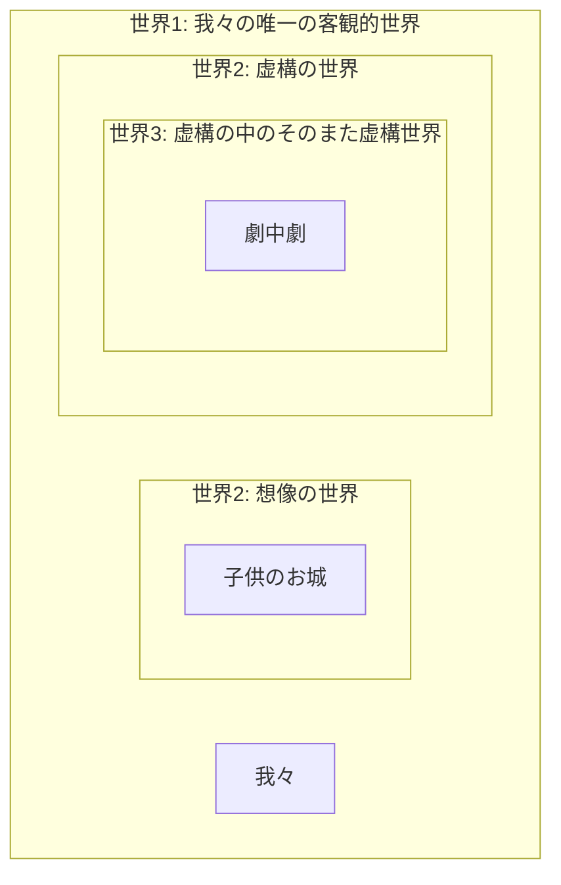

# 想像の多世界説の観点から準観察テーゼを反駁し直す

## 京念屋 隆史

---

# 知覚と想像の識別問題への答え（おさらい）

- 問い：想像は知覚と何によって識別されているか
- 答え：ある**世界越し**に観られた世界、それが想像された世界である。そうではなく直接見られた世界が知覚された世界である
	- 想像における観入（hineinshauen）とは、正確に捉えるなら、世界1にいる我々が世界2の内へと完全に移動してしまうような経験ではない。そうではなく、世界1に軸足を残したまま世界2の中に入ること、あるいはむしろ、世界1を**額縁**として、そこに嵌め込まれた世界2の中を覗き込むことである
	- だから私は想像世界に観入しているとき、私はいま「入って」いるにすぎない、ということを識っている。すなわち、この目の前に展開されている真正の世界は、どんなに真に迫るものに感じられようとも、その外部がある、ということ、それゆえこれは入れ子にされた世界にすぎないことを、**その当の入れ子の内側から**識っている<!-- - 「その当の入れ子の内側から識っている」がゆえに、上昇して外側に出るまでそれが虚構であると識らなかった、ということは起こらない -->

---

# 準観察テーゼは同内容性の原理につまづく

- デカルトの夢の懐疑に登場する、「目が覚めているときに起こりうることや経験しうることのすべてについては、夢で見ることもありうる」（`Stroud 1984`, p. 18/40）という原理
- ひとはどんな内容の夢も見ることができる。ゆえに夢と現実との間の差異をその**内容**によって識別することはできない（ゆえに内容説は挫折する）
	- 頬をつねっても痛みの感覚がないなら夢？ 否、「頬をつねって痛みがする」**という内容の夢**を見ることができてしまう
- この原理は夢だけでなく想像にも適用できる
	- 想像も知覚も同じく一つの世界を開く作用である。この点で想像と知覚を構造上も（→本論文4-1）内容上も（→本論文9-1）同様のものとして扱わなければならない
- すなわち、ひとはどんな内容の想像もすることができる。ゆえに想像と知覚との差異をその内容によって識別することはできない
	- 観察することができないのが想像である、という考えはこの原理につまづくはずではないか。「対象を観察する」という内容の想像をすることができるのだから

---

# サルトル側からの想定反論

- 「対象を観察する」という内容の想像をすることができる、例えば上の面が2のサイコロを手で転がしながら裏側の面が5であることを観察する、という内容の観察ができるというのは確かかもしれない
- だがそれは、**観察することそれ自体を想像しているだけ**であって、実際に観察しているわけではないのではないか
- あるいは、観察することをそれ自体を想像してみても、**観察するふり**をすることにしかならないのではないか
	- > イメージは学習されない。〔…〕たとえ戯れに頭のなかでイメージとしての立方体を回転させたり、イメージとしての立方体が多様な面を示すふりをする〔feindre〕としても、その操作が終わっても進歩などない。（`Imaginaire`: 25/47）
- 観察することそれ自体をいくら想像してみても、それは想像された観察にすぎず、想像された観察は観察そのものにはなれない。だから観察するふりになってしまうのだ

---

# 多世界説の観点から準観察テーゼをもういちど反駁しなおす

- この、想像的な観察はふりにしかならない、というサルトルの考えに対して、私はかつて、それには例外もある、という形で反論した（＝①例外の反論）
	- 想像された観察であるにもかかわらず実効的であるような観察がある（例：子供の空想）
- しかし、ここではさらに先へと押し進めたより徹底的な別の反論②を考えたい
- ふりでない実効的な観察がある、と例外を指摘するような反論は他方で、ということはやはりふりにしかならないような想像的な観察も確かにあるということを認めていた
	- 実際、準観察テーゼの論拠にされていた、心の中でサイコロを転がしてみても観察するふりにしかならない、という具体例には揺るぎない説得力がある
	- しかし、なぜサイコロの観察はふりになるのか。このことを考えることで、準観察テーゼの中にまだ批判されずに伏在している残った先入見をも打ち破ることができる

---

# 想像することとふりをすることは別のことである

- サルトル側の議論の展開はこうだった。想像されたものは観察されない、というサルトルの考えに対して、いや、心の中でサイコロを転がしながら観察できるではないか、という反論を受けたとしても、サルトルは、いや、それは観察することそれ自体を想像しているだけであり、ゆえに観察するふりにしかならないのだ、と難なく答えられる
- この論証は申し分のないものに見えるが、にもかかわらず、ある前提が潜んでいる。それは、想像的な観察ではない、現実的（知覚的）な観察だけが観察たりうる、という前提である
- この前提はさらに、ある先入見に基づいている。それは、想像的であることをふりであることと直結させ、知覚的であることとふりではない（実効的である）ことを直結させる、という先入見である
- だが、この同一視は維持できない。なぜなら、①想像的であるにもかかわらず実効的であるような観察もあるし、②現実的であるにもかかわらずふりになってしまうような観察もあるからだ

---

# 想像することとふりをすることは別のことである（つづき）

- ①観察するふりになってしまうということは、それは想像的な観察である、ということなのだろうか。ふりと想像は直結させられるのだろうか
	- それは違う。実際、想像されたお城のことを子供は確かに地平的に探索するではないか。むしろそれは、**想像的な観察であるからこそ実効的なのだ**、と言いたい
- ②逆に言って、現実的な観察だけが観察と言える、と言えるのだろうか。知覚的であることとふりではないこと（現実的であることと実効的であること）とを直結させられるのだろうか
	- むしろ、サイコロの例が示しているのはそれとは真逆のことではないか。つまり、それは現実的な観察であったからこそ無効だった、と言えるのではなかろうか
- ※想像的な世界に対する観察は必ず想像的である、というような一致関係は実は存在しない。想像的な世界のことは、想像的に観察するだけでなく、現実的に観察することもできる
	- これが、内側からの眺めと外側からの眺めの二種類が存在するということの意味である。<!-- 世界
	- と、それに対する態度の間には分離がある -->

---

# 同じ階層の世界だけが観察できる——多世界説

- 想像的な観察こそが実効的な観察たりえ、現実的な観察の方がむしろふりになってしまう、というこの逆説は何を意味しているのだろうか<!-- 	- だとすれば想像的か現実的かは観察の有効性に関係ないということだろうか。そうではなく、 -->
- それは、知覚的な世界のことは知覚的に、想像された世界のことは想像的に観察しなければならない、ということである
	- 加えて言えば、たとえ想像的なもの同士であるといっても、ハムレットが、その劇中劇の世界、想像世界を観察するとしても、それは無効であろう
	- つまり、想像的なもの同士である、というだけでは足りないのだ。そうではなく、世界とそれに対する観察は**同じ階層において**想像的でなければならず、そのようなものとして世界を共有していなければならない
	- 例えばレベル3の想像世界はレベル3の想像的観察者としてのみ観察可能となる

---

# 世界の多重入れ子構造（おさらい）

- 世界1：最も外側にある我々の知覚世界。いつ誰がみても同一の、唯一にして客観的な世界
	- 世界2：この世界1の内側に入れ子になって成立している、想像やフィクションの世界
		- 世界3：例えばフィクションである演劇のさらに内側で演じられた劇、劇中劇の世界

---

# 同じ階層の世界だけが観察できる——多世界説（つづき）

- この観点からすれば、現実的な観察だけが観察たりうる、という先ほど槍玉に挙げられた先入見すら一周回って肯定されることになる。それはつまり、レベル1の世界がレベル1の観察者として観察可能である、ということ以外の何ものでもない
	- 現実世界とはつまり、たまたま世界1にいる我々からみた世界1の名前のことである。それは世界2にいる者たちにとっては世界2が現実世界となるのと同じことにすぎない
- 想像に観察性を認めないのはいわば自世界中心主義なのである。そうではなく、観察することと観察されるものは同一の世界に属していなければならない<!-- （世界を跨いで観察しようとするとすでに知っていることしか観察できない） -->、というのが世界中立的なテーゼになるだろう
- このことから我々は自らの説を「多世界説」と呼ぶ
	- 自世界とか現実世界とかいうのは、つねに世界1を指し示す固有名詞ではなく、指標詞 indexical として機能する

---

# 違う階層の世界はのっぺりと現象する

- 知覚的な世界のことは知覚的に、想像された世界のことは想像的に観察しなければならない、ということは、逆に言えば……
- 想像された世界をその外側にある現実世界から観察しようとしても、つまり、**世界同士の境界線を跨いで観察しようとしても、それは無効になる**、ということである
	- 世界を跨いで観察しようとするとすでに知っていることしか観察できなくなる
- サルトルの言っていた観察するふりになってしまうとは、それが想像的な観察であるからではなく、想像された世界を現実的に観察しようとているからだからだ、と言える。そのギャップが観察を無効にしている
- 他方で、夢の観察が有効であるのは観察する私もまた夢を見ているからであるが、しかし、醒めた後に観察しようとするとそれは奥行きを失って平面に戻ってしまっており、それ以上の細部を埋めようとすることができなくなる

---

# 二種類の世界跨ぎ性

- ところで、これまで述べてきた「世界を跨いで」見る、ということについて、二つの水準があることにお気づきだろうか
- いましがた述べてきたのは、想像された世界の内側に入って観察したり、外側の世界から跨いで観察したりできる、という話だった。跨がなかったり跨いだり、というこの二つのモードは切り替え可能で、可変である
- しかし他方で、想像である限り——たとえどんなに観入していようとも——こちらからそちらへと世界を跨いで見ている、という意味での跨ぎ性もある。こちらは想像である限り切り替え不可能で、固定されている
- この両者を混同しないことが枢要

---

# 視点位置の可変性・身体位置の固定性

- 前者の、世界を跨いで観察したり跨がずに観察したりできる、という意味での切り替え可能な跨ぎ性の有無が、**準観察と観察の差異**、という可変的な想像の二つのモードを作り出している
- 後者の、想像である限り必ず世界を跨いで見ている、という意味での切り替え不可能な跨ぎ性の有無が、**想像と知覚の差異**という固定的な識別を作り出しているものにあたる
- 前者は、想像世界を見るときの視点位置をその世界の内側に置いたり外側に置いたりできる、ということを指している。これに沿って言うなら、後者はいわば身体位置のようなもので、身体位置はどんなときもその想像世界の外に、こちらの現実世界にある
	- 身体位置がこちらの世界にある、という点は動かないのだが、しかし、視点位置だけはその身体位置を抜け出て、内側の世界に入り込むことができる。このとき観入が成立する
		- ドローンカメラのようなものを思い浮かべて欲しい
	- ゆえに観入の意識は視点位置と身体位置の間で引き裂かれている

---

# 視点位置の可変性・身体位置の固定性（つづき）

- サルトルは可変的なモードの区別（準観察／観察）の中に固定的であるべき識別原理（想像／知覚）を見い出そうとしたために失敗した
	- これは、サルトルが、世界が場合によって準観察的に立ち現れたり観察的に立ち現れたりする、という可変性を知らなかったため
- しかし我々はこの可変的なモードの水準（準観察／観察）をも再び取り上げて我々の理論の中に取り込みたい。これは識別問題を解くためだけなら不要なのだが、これ自体が一つの新たな問題を提起していた
	- （実際、識別問題を解くためだけだったら、その候補の一つにすぎない準観察テーゼにこんなに深く携わる必要などなかったはず）
	- この準観察性は、想像（準現在化）の問題とは別の、**中立性変様**の問題として定式化することができる！

---

- 世界性の有無、という、あるものが世界として構成されたり構成されなかったりする、という重大な差異が、ただ視点の取り方の差異によって容易に動いてしまう可変的な差異である、というのは驚くべきことではないだろうか
	- このことは、想像世界だけでなく、この現実世界についても妥当するのではないか。つまり、この現実世界の世界性すらも、それが構成されたりされなかったりするような決して固定的ではない何かなのではないか
	  - 「知覚世界」という言い方があるが、知覚的であることと世界であることとは実は別の事柄なのではないか

---

# 準現在化と中立性変様——想像と虚構の差異

- 身体位置と視点位置の差異と我々が呼んだものは、フッサールにおいて、準現在化と中立性変様の区別に対応するものである
	- 身体位置は移動不可能であり、これが想像と知覚の差異を作り出す。これが**準現在化**に相当する。これは我々の言う意味での**想像**にあたる
	- **視点位置**は移動可能であり、これが準観察と観察という可変的な差異を作り出す。こちらは**中立性変様**に相当する。これは、想像との区別において、**虚構**と呼ばれるのが最も相応しい在り方をしている

---

# 中立性変様とは何か——教科書的説明

- 中立性変様とは、ある事態が実在することについての信念定立を差し控え、宙吊りにすることを指す
	- 例えば地球が丸いという判断を「私は信じている」というのが定立的であり、「私はあたかも信じるかのようである」（信じるでも信じないでもない）というのが中立的である
- 判断を差し挟むことを控える、ということは、そのことを疑うとか信じないとかいったことではない
	- なぜなら、疑わしい、というのも一つの信じることの一様態だから
		- デカルト的懐疑すらなお信念の領域の中を動いてしまっている（フッサール）
	- ある判断を信じないとか疑わしいなどと決めつけることそれ自体の中に定立的な信じることが含まれている。そのような、疑いや不信の中にすら含まれているような信念性格そのものも宙吊りにされて初めて、それは中立性変様と呼べるものになる
- このように、定立的な信念には、「〜を信じる」だけでなく、「〜は蓋然的に思われる」「〜は疑わしい」といったものも含まれる。それらはどれも信念の性格であるため、その全てに対して、信念の中立性変様、蓋然性の中立性変様、可疑性の中立性変様、といったものが対応する
	- つまり、定立的諸性格の全てをコピーしたネガとして中立的諸性格がある

---

- 準現在化と中立性変様はいずれも、現在化であり定立的であるところの知覚の反対物としてよく似ている
- しかし、準現在化は**直観**の水準に、中立性変様は**判断**の水準に属する、という大きな違いがある
	- 直観の水準は判断の水準に先立つ
- 準現在化は直観化の様態であるため、任意に変更できない。つまり、目の前にある机が「知覚されている」という性格を、意志によって「想像されている」に置き換えることはできない
- これに対して中立性変様は判断の信念性格の様態であるため、地球が丸いという判断を「私は信じている」という性格を、「私は信じるのでも信じないのでもない」という性格へと置き換えることができる

---

- しかし「地球が丸い」といった単体の信念を考えておいて、それに中立化という操作を加える、というふうに考えてしまうとこの概念は分からなくなる
	- 単体の信念で考えるのもまずいし、定立的信念からの移行、という動的な仕方で捉えるのも狭すぎる
- よりましなやり方は、いわゆる想像、空想を例にとることである
	- ただしここでは大人がするような想像を考えてほしい。つまり、子供がするような空想というよりは、単なる想定、シミュレーションに近いものを考えておいてほしい
- 知覚は現在化的かつ定立的であり、想像は準現在化的で中立的である。ゆえに準現在化と中立化はよく混同されることがある
	- しかし、定立的であるような準現在化というものもある——それは想起である。想起は実際に過去に存在した事態についての実在性定立を含んでいる
	- （そうであるなら、中立的であるような現在化というものもあるのではないか？ →還元）
- 何が言いたいかというと、単体の信念単位でオンオフを考えるのではなく、世界単位で括弧に括ることを考えたほうがいい
	-	世界ごと括弧に括って虚構世界にすると、自動でその世界内の単体の信念の信念定立も持っていかれる、と理解すべき
	- 虚構世界という囲いの中で何を信じようが何を疑おうが、信じることの中立性変様において、疑うことの中立性変様においてそうするだけになる
