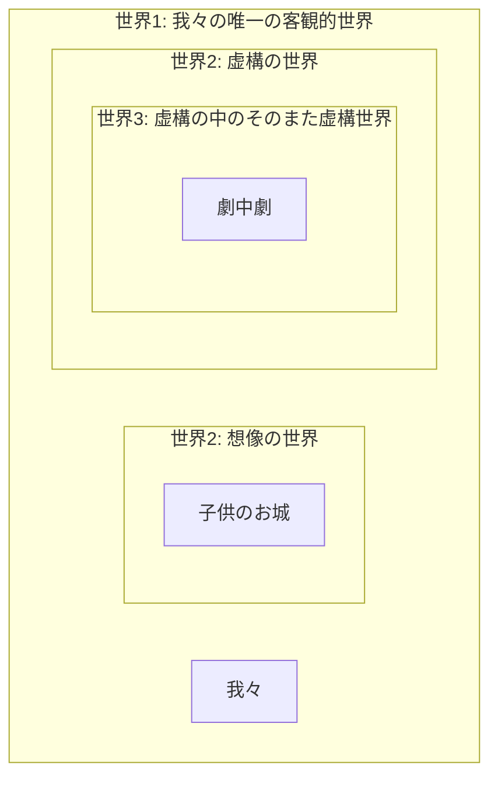

# 博論の全体構成

## 京念屋 隆史

---

# 想像と知覚の識別問題

博論全体を貫く根本的な一つの問い。

> 本稿の目的は、知覚と想像との差異は何か、とりわけ、想像はどのようにして知覚から識別されているか、という問いの論究である。これは言い換えれば、見ることと思い浮かべることの差異とは何か、とりわけ、なぜ想像は「心の中で」思い浮かべられているにすぎず、心の外に実在するものの表象ではないと分かるのか、という問いである。（京念屋隆史（2022）「サルトル想像論における「準観察」のテーゼ——想像と知覚の差異について」『大学院紀要』(89): 10–19, 法政大学大学院, p. 10）

---

# 博論の目次（抜粋）

- A 心像を物的像からの類比によって捉えようとするあらゆる見解に対する反駁
	- A1 心像は像ではない
	- A2 意識像は像ではない
- B 想像的な世界なるものは存在するか——想像の世界性をめぐる争い
	- B1 想像に世界性はない——サルトル想像論における「準観察」のテーゼ
	- B2 想像にも世界性はある
- C 多世界説とはなにか
	- 想像の多世界説——識別問題に答える
	- 知覚の多世界説——多世界説の発展形

---

# 博論全体の構成

以下のような三部構成となっている。

```mermaid
flowchart BT
    A1 --> A2
    A2 --> B1
    B1 --> C[C 多世界説]
    B2 --> C
subgraph A 想像の「像」説批判
    A1[A1 心像説批判]
    A2[A2 意識＝像説批判]
end
subgraph B 想像の世界性をめぐる争い
    B1[B1 準観察テーゼ擁護]
    B2[B2 準観察テーゼ論駁]
end
```

---

# A1 想像の<ruby>像<rt>イメージ</rt></ruby>説批判

---

# A1 **心像を**物的像からの類比によって捉える見方

- 想像のイメージ説：想像は心的<ruby>像<rt>イメージ</rt></ruby>を介して対象を思念するものであり、知覚はそのような媒介なしに直接対象を思念するものだ、という識別基準を立てる説
	- この見方は実のところ、物的イメージをモデルにして心的イメージを考察しようとしている

> さて、ここで、もし想像が物的像と同じような仕方で「像」の仲間であるなら、**想像と**知覚の差異は、**像と**知覚の差異に帰着させることができる。それは実物を見ることと写真を観ることの差異と同じくらい明白な差異であることになるだろう。これが物的像の類比によって「心像」を捉えようとする見方の利点、というよりほとんど誘惑である。実際、「物的像はなぜ像にすぎないと分かるのか」「写真の人物はなぜ目の前にいる知覚された人物ではないと分かるのか」などという問いは心像のそれに比べてあまりに自明である。実物は実物であり、像はそれの像なのであって、この二つのものに区別があるのは、現物がそれのコピーと取り違えられたりしないのと同じことである。それゆえ、心像とそれの対象の関係もまたこれと同じようなものであってくれれば、問題は解けたも同然だということになるだろう。（博論 A1, 1-1）

---

# A1 **心像を**物的像からの類比によって捉える見方への批判

- 我々が想像するとは、心像を対象として見るのではなく、心像**を介して**対象を思念することだ、とサルトルは言う
	- だが、それを言うなら物的像だって、それに観入するときにはその像そのものを対象として見ることをしないではないか
	- これは物的像にも当てはまる議論にすぎず、この見方は、心的イメージを「物」化はしていないにせよ「物的像」化している
- 想像が対象を思念するための媒介的な代理物であるなら、心像を通り抜けて対象を思念するのをやめて、心像そのものにまなざしが留まることが可能であることになってしまうはず
	- この見方は、なぜ我々はつねに心像を突き抜けて対象そのものを思念してしまうのか、という点（＝心像の透明性）を説明できない

---

# A1 **心像を**物的像からの類比によって捉える見方への批判（続き）

> 本論文1-1で見たように、フッサールもまた当初、サルトルと同じく、想像を「像」の一種として捉えることによって知覚から区別しようとしていたが、しかしのちにその考えを完全に捨てた。すなわち、〔…〕「想像と像意識」講義（1904/05）以降のフッサールは、想像を（知覚と同じく）対象へと向かう直接的、無媒介的な統握と見なすようになり、想像を像性表象の一種と見なすことをやめる。これはやはり一つの驚くべき結論である。日本語でも「想**像**」と言うのだし、像も想像も同じく〔…〕目の前にない不在ないし可能的なものを思い浮かべる作用であるにもかかわらず、**想像は像ではない**のだ。〔…〕想像表象は〔…〕それゆえ、対象そのものを<ruby>直<rt>じか</rt></ruby>に、像や記号などの媒介を経ることなく無媒介に目指す作用なのである。（博論 A2, 4-1）

- 想像は代理物による媒介を経て対象を思念し、知覚は媒介なしに直接対象を思念する、といった区別は維持できない
	- そうではなく、想像もまた対象そのものを媒介なしに直接志向する作用である
- 知覚も想像も対象そのものを無媒介に目指す作用であり、その点で両者を区別することはできない
	- この両者が実は構造上区別できないからこそ、想像と知覚の識別問題は真正の問題として浮上してくる
- A1ではこのような、**想像を**像に見立てて論じる見方を批判する

---

# A2 心像と知覚像のどちらも物的像からの類比によって捉えようとする見方

- 先の見方は、想像と知覚を識別するために、その二つを構造上別のものとして峻別しようとした結果失敗した（→知覚は無媒介であり、想像は像を媒介とする）
	- この失敗は、知覚と想像を構造上同列に捉えてやれば回避できる（→知覚も想像も無媒介である）
- しかし、この失敗を回避するだけなら、想像だけでなく**知覚もまた像を媒介として対象を思念する**、と捉えても論理的に矛盾はないはず
	- そして実際『イデーンⅠ』のフッサールはそうも捉えている
- これによって、知覚や想像は「意識への現れを介して対象を捉える」という主張と、「いかなる媒介もなしに対象を捉える」という相矛盾する主張が併存させられている。これこそが「志向性」という概念を成り立たせている二枚舌である
- A2の目的はこれを示すこと。志向性理論はどこまで行っても抜きがたく「像」の理論であり、それは想像だけでなく知覚をも物的像からの類比によって捉えようとする見方を内包している

---

# A2 心像と知覚像のどちらも物的像からの類比によって捉えようとする見方への批判

- 意識表象に「素材（ヒュレー）」なるものがあるという見方
- 現象学的還元という仕方でこの世界（という像）への観入的態度から「上昇」できるという見方
- この批判を経由して、「知覚も想像も対象そのものを無媒介に目指す」という論点を堅持したい。そのうえで両者の識別問題を次の第B部に持ち越す

---

# AからBへの移行

Aでの「像の類比」批判に耐えうる識別理論の有力候補として、Bではサルトルの準観察テーゼを検討する。

- A1・A2の批判から、心像を「像」の類比によって捉えようとするあらゆる見方が批判された
- ゆえに、想像と知覚の識別理論として、この禁則に抵触しないような理論を探さなければならない。そこでサルトルの準観察テーゼが登場する
- このテーゼは、想像と知覚の差異を、その**世界性の有無**という根本的な差異によって識別しようとする有力説である

> **想像的な世界は存在しないという想像力の大法則**〔…〕。〔…〕人は、このイメージとしての世界〔＝夢の世界〕の細部を見ないし、細部を現前化することもないし、そうしようと企てることさえない。その意味で、イメージは互いに孤立したままであり、本質的貧しさによって切り離されたままであり、「空虚のなかで」準観察の現象に従属したままである。（Imaginaire: 322f./374）

---

# B 想像の世界性をめぐる争い

B以降の議論の弁証法的段階の見取り図を提示しておく。
 
- B1 準観察テーゼ：想像には世界性がない
	- → B1 想像には世界性がないvs B2 想像にも世界性がある、という対立が生じる
- B2' 世界の世界性の視点依存性：ある世界が世界性をもつかどうかは、その世界が内側から生きられるか、外側から眺められるか、という観測者の視点に依存する
	- → 準観察テーゼの復活と換骨奪胎：「準観察」とは世界の外側からの眺めのことだったのではないか
	- → 我々のこの外側なき世界を外側から眺めることはできるか？：現象学的還元について論じる

---

# B1 想像された世界には世界性がない

サルトルの準観察テーゼ。

- サルトルにおいて知覚と想像の差異は、最終的には、「**知覚されたものには世界性があるが、想像されたものにはない**」という一点に集約された。ここでの「世界性」とは次の三点にまとめられる。
	- 細部がない
	- 既在性がない
	- 射映性と地平性（＝世界の奥行き）がない

---

# 想像には既在性がない——準観察テーゼ①

既在性：元からそうであったようなものを後から発見すること。

> 観察とは、表象に含まれていた未規定な部分を埋めることによって、それが表象していた対象の詳細をしだいに明らかにしていくことである。それゆえ、サイコロの裏面をひっくり返して確認したり、盲点になっていた側面の目にも意識を向け直したり、その目の数を数え上げたりする、というのがサルトルの言う意味での「観察」の例である。
> 
> では、同じことを想像でもやってみよう。先ほどのように「上2・下5のサイコロを思い浮かべよ」と言われて実際に思い浮かべた後に「では次に側面の目はどうなっているかよく見てみてください」と言われたが、このとき側面の目のことなど考えてもいなかったとしよう——ここまでは問題はない、同じことは知覚でも起こるのだった。しかし返答に窮するのはこの次の瞬間からである。自分の想像イメージを、それも自分が思い描いていなかった部分を観察するように言われても、「もともと考えてもいなかったものを、今から見ろと言われても……」という困惑が生じるのではないだろうか。ここでは、3でも4でもどの目を答えてもよいが、どの目を答えようとあらかじめ不適当であるように思われる。この問い（側面の目は何だったか）にはあるべき答えがない。正確には、自分が**いま**恣意的に決めた答えではない、私が見る前から**あらかじめ**決まっていたような答えが欠けているのだ。つまり、観察とは一般に、もとからそうであったものを見ることでなければならないのだが、そのあるべき既在性が想像された対象には欠けているのである。（京念屋 2022, p. 15）

---

# 想像には地平性がない——準観察テーゼ②

地平性：世界が自分の知覚している範囲を越え出るような細部や奥行きを備えていること。

> 例えば視界の縁に目を向けるたびにその限界の先にあったものが露わになることや、地球の裏側もまた私が見る前からあらゆる細部があらかじめ確定している（という信憑がもたれている）ことなどが、世界の地平的なあり方の例である。しかし想像ではどうだろうか。先ほど思い浮かべていただいたサイコロの、その視野の縁の向こうには何があるだろうか？  「そちらに目を向けると木でできた机の表面が広がっており、さらに進むと机の角があった」などということはなく、見切れた視野の中に、孤立したサイコロが一つ存在していただけではないだろうか。このことは、想像が（知覚や夢がそうであるような）一つの世界を開く作用であることを疑う十分な根拠となりうる。
> 
> さらに、世界の広がりに関して言えることが、その奥行きに関しても言えるだろう。サイコロの下面を裏返して見てみようとしてもうまくいかなかったのは、ある意味では想像においては裏側というものが存在する余地がないからである。イメージには自分の知らないところがないのは、知らない部分は単に欠落しているからだ（これを「イメージにおいてはすべてが知られている」と解するべきではないのだった）。だから「それ以外にも隠れた関係があるとか、照明を当てられるのを待っている、などと言うべきではないだろう」（Imaginaire: 26/48）。かくして、イメージの「世界」は、奥行きがなくのっぺりとしている。これが、サルトルの言う「想像的な世界は存在しないという大法則」（Imaginaire: 322/374）の意味するところである。（京念屋 2022, p. 16f.）

---

# B2 想像された世界にも世界性がある

こちらの立場はまだ誰も主張していないので自前で主張を立てなければならない。さしあたり、前者の反論1をさらに展開させる。

- 反論1：世界性を持つような想像もあるのではないか
	- 例：子供の空想。一連の長いストーリーをもった「続きもの」の想像。
		- 子供はしばしば、昨日行った空想の続きを今日も考えることで、**同じ世界に**何度も何度も入り直して、その世界の細部をどんどん豊かにしていく
		- これは、我々が昨日も今日もこの同じ知覚世界の中に入ってその細部を観察によって満たしていくのと同じことではないか。想像も知覚と同じような真正の世界性をもつ
- 反論2：世界性を持たないような知覚もあるのではないか
	- 例：知覚に対する現象学的還元、とくに形相的還元
		- これは**世界性をもたない知覚**というものを作り出そうとする試みではないか

---

# 子供と大人の対立：世界の細部を後から埋めることは発見なのか事後的創作なのか

一つの思考実験を例にとって、想像の世界性を否定する立場と肯定する立場との対立を浮き彫りにする。

## 思考実験：空想されたお城の3階には何があったか

> 空想の「世界」の中で立派なお城に住んでいると言い張る子供に対して、「じゃあ、そのお城の三階部分には何があるの？」とその父親が聞く。子供はとても長い間沈黙した後に、「……ああ、そうだ、使用人が泊まる宿舎があるんだった」と答えた。しかし実際にはその子供は、大人にそう聞かれるまでは、お城に複数の階があるなどという発想すら持っていなかった。だから大人は「いやいや、いま考えたでしょ」といって茶々を入れた。しかし子供は、「いいや違う、いま僕が考えたわけじゃない、元からそうなっていたんだ」と答えた。（博論 B1, 9-2）

---
layout: two-cols-header

---

# 大人vs子供の対立：既在性をめぐる争い

同じ論点をめぐって真逆の主張がなされている。お互いに相手の主張の意味を完全に理解でき、かつ結論だけが真逆であるため、調停は不可能。

::left::

## 大人

- 大人：「いやいや、いま考えたでしょ」
	- 元から既にそうなっていたお城の上階をいま観察して発見したわけではなく、いま新たに創り上げただけでしょ
	- 想像には**既在性**という世界性の本質が欠如している、という反論

::right::

## 子供

- 子供：「違う、元からそうなってたんだ」
	- 今まで気づかなかっただけで、いま観察して見つけたんだ。僕が勝手に考えたわけじゃない
	- 想像された世界は私が見る前から既にそこにあったのであり、私はそれをただ発見しただけだ、という主張

---

# 子供の逆襲：視点そのものが複数存在することの示唆

先ほどより少し賢い子供を想定する。大人の側の主張の妥当性を全て認めたうえで、その主張の根拠をなしている立脚点そのもののずれを指摘する。

> 「お父さんの言っていることは分かるよ。それでも僕は毎日、自分の想像の世界の中に入って、そのお城の中で生きてるんだ。お父さんがそうやって言うのは、僕のこの世界の内に一緒に入らないで、それを外から眺める醒めた態度を取ってるからでしょ？」

- 空想のお城のあるその世界はほんとうに世界性を備えているか否か、という世界性の有無をめぐる対立があるのではなく、ただ、その当該の世界を内側から見るか外側から眺めるか、という視点の対立だけがあるのではないか

---

# 対立の真の意味：世界の世界性の視点依存性

空想の世界と同じことがフィクションの世界についても妥当するのではないか。子供のさらなる追撃。

> 「それに、お父さんだって、いつも楽しみにしている連載小説の続きを読むときは、今まで明らかになっていなかった世界の細部がいま初めて明らかにされた、という態度で読むでしょ？ 僕が「へー、作者は今週はこういう設定でこう創ってみせたんだね」って茶々を入れたら怒るじゃん」

- いかなる世界も、内側から生きられたときには真正の世界性をもつ世界として現れ、外側から眺められたときにはただの自由で恣意的な作り物に見える
- まだ気づかれていなかったが既に確定していた細部を観察によって後から埋めたのか、ただ単に何も考えていなかったものをいま恣意的に創り出したり修正したりしただけなのか、という根底的な見方の違いが、世界の内に入るか外に出るかという視点の違いだけから生じる

---

# 外側からの世界の眺め：準観察テーゼの復活

- 視点依存性テーゼのおかげで、サルトルの準観察テーゼ（想像には世界性がない）はむしろ完全に復活させることができる。すなわち準観察テーゼは、**ある世界をその外側から、世界越しに眺めたときの眺め**の記述としては完全に正しいことになるだろう
	- つまり、サルトルの言う「想像」は、実質的には、「外側から眺められたときの世界」ということしか意味していない。ゆえに彼の言う「想像」という語を「外側から眺められた世界」と置き換えて読むことができる
		- 「**想像された**世界には地平性がない」：これは偽
		- 「**外側から眺められた**世界には地平性がない」：これは真！

---

# 外側からの世界の眺め：準観察テーゼの復活（続き）

- 「外側から眺められた世界は世界性をもたない」（準観察テーゼ改）
	- こう捉えれば彼の準観察テーゼを救えるどころか、これが想像だけに限定されたテーゼではない、**任意の世界を**その外側から見たときの眺めに妥当するテーゼとして生まれ変わる
	- ということは、**この知覚世界（世界1）をその外側から眺めることができたなら**、その外側からの眺めについても、サルトルの準観察テーゼが妥当するのではないか？
		- →現象学的還元の問題
- 外側から眺められた世界は……
	- 無限の細部をもたない
	- 射映しない
	- 地平性をもたない
	- 既在性がない

---

# 世界の多重入れ子構造

- 問い：もし想像も知覚と同じく無媒介に一つの世界を開く作用であるなら、同じ世界を開くもの同士、どのようにして想像は知覚から識別されているのか分からなくなってしまうのではないか？
- 答え：次のような世界の入れ子構造を考えてみてほしい
- 世界1：最も外側にある我々の知覚世界。いつ誰がみても同一の、唯一にして客観的な世界
	- 世界2：この世界1の内側に入れ子になって成立している、想像やフィクションの世界
		- 世界3：例えばフィクションである演劇のさらに内側で演じられた劇、劇中劇の世界

```mermaid
graph TD
  subgraph W1[世界1: 我々の唯一の客観的世界]
    A[我々]
    subgraph W2[世界2: 想像の世界]
        B[子供のお城]
    end
    subgraph 世界2: 虚構の世界
      subgraph W3[世界3: 虚構の中のそのまた虚構世界]
        C[劇中劇]
      end
    end
  end
```

---

# 知覚と想像の識別問題への答え——想像の多世界説

想像は知覚と何によって識別されているか、という問いに対する答え。

- 答え：ある**世界越し**に観られた世界、それが想像された世界である。そうではなく直接見られた世界が知覚された世界である
	- だから知覚と想像は内容的には区別ができない。両方とも一つの観察されうる世界を開く作用であるから
- 想像における観入（hineinshauen）の経験とは、正確に捉えるなら、世界1にいる我々が世界2の内へと完全に移動してしまうような経験ではない。そうではなく、世界1に軸足を残したまま世界2の中に入ること、あるいはむしろ、世界1を額縁として、そこに嵌め込まれた世界2の中を覗き込むことである
	- だから私は想像世界に観入しているとき、私はいま「入って」いるにすぎない、ということを識っている。すなわち、この目の前に展開されている真正の世界は、どんなに真に迫るものに感じられようとも、その外部がある、ということ、それゆえこれは入れ子にされた世界にすぎないことを、**その当の入れ子の内側から**識っている

---

# なぜ我々の知覚世界は唯一にして絶対的な客観的世界なのか——知覚の多世界説

それは視点に依存しないのではなく、たまたま外側の視点がないからではないか？ この知覚世界が絶対的に見えるのは、我々がそれに対して内側から生きることしかできない、というまさにその内側の視点に依存しているのではないか？

- 問い：なぜ我々の知覚世界は唯一にして絶対的な客観的世界なのか
- 答え：我々のこの知覚世界はたまたま、入れ子になった諸世界のうち最も外側の世界であるから。つまり、この世界1よりも外側にあるような、より上位の世界（世界0）なるものがもはや存在しないから
	- 空想の世界（世界2）の外に出てそれを外側から眺めるようにして、我々のこの知覚世界（世界1）の外に出ることはできない
	- ゆえに我々はこの知覚世界をただもっぱらその内側から生きることしかできない。我々は内側から生きられたときのこの世界をしか知らないので、その世界性は他と違った絶対的な（外側から眺められ無化されることのない）世界性をもつように見える

--
